# Mastering Packer Proxmox: Building Automated Ubuntu 24.04 Templates

Tired of manually clicking through Proxmox every time you need a new VM? Setting up fresh Ubuntu machines by hand is not just tedious—it's inefficient and prone to human error, especially when managing multiple environments. In this comprehensive guide, I'll show you how to automate the entire process using Packer to create reusable Ubuntu 24.04 templates in Proxmox.

## Introduction to Packer Proxmox Automation

Infrastructure automation has become essential for modern IT operations. Whether you're running a home lab or managing enterprise infrastructure, manually creating virtual machines is time-consuming and inconsistent. Packer, a HashiCorp tool, solves this problem by providing a standardized way to create machine images across various platforms, including Proxmox.

In this guide, we'll explore how to use Packer to automate system installations and create Ubuntu 24.04 templates in Proxmox. These templates can then be used to quickly spin up new VMs with consistent configurations, saving time and reducing errors.

### Workflow Overview

The following diagram illustrates the complete workflow we'll implement:

```mermaid
flowchart LR
    %% Nodes
    ISO["Ubuntu 24.04 ISO
    ubuntu-24.04.2-live-server-amd64.iso"] 
    
    subgraph Config["Packer Configuration"]
        HCL["ubuntu-2404.pkr.hcl"]
        VARS["variables.pkrvars.hcl"]
        SECRET["secrets.pkrvars.hcl"]
        CLOUD["http/ 
        user-data & meta-data"]
    end
    
    BUILD["Packer Build Process
    ./build.sh"]
    
    subgraph PROV["VM Provisioning"]
        INSTALL["OS Installation"]
        CLOUDINIT["Cloud-init Configuration"]
        DOCKER["Docker Installation"]
        OPTIMIZE["System Optimization"]
    end
    
    TEMPLATE["Proxmox Template
    ubuntu-2404-template
    VMID: 9001"]
    
    UI["Manual Cloning
    (Proxmox UI)"]
    
    TF["Terraform Deployment"]
    
    VM1["Single VM"]
    
    subgraph MULTI["Multiple VMs"]
        VM2["VM 2"]
        VM3["VM 3"]
        VM4["VM 4"]
        VM5["..."]
    end
    
    %% Flow
    ISO --> Config
    Config --> BUILD
    BUILD -->|"~6 minutes"| PROV
    INSTALL --> CLOUDINIT --> DOCKER --> OPTIMIZE
    PROV --> TEMPLATE
    
    TEMPLATE --> UI
    TEMPLATE --> TF
    
    UI --> VM1
    TF --> MULTI
    
    %% Styling
    classDef ubuntu fill:#E95420,color:white,stroke:#772953
    classDef packer fill:#844FBA,color:white,stroke:#4C2889
    classDef proxmox fill:#E57000,color:white,stroke:#923F00
    classDef terraform fill:#7B42BC,color:white,stroke:#4C2889
    classDef vm fill:#14b8a6,color:white,stroke:#0f766e
    
    class ISO ubuntu
    class Config,HCL,VARS,SECRET,CLOUD,BUILD packer
    class PROV,INSTALL,CLOUDINIT,DOCKER,OPTIMIZE packer
    class TEMPLATE,UI proxmox
    class TF terraform
    class VM1,VM2,VM3,VM4,VM5,MULTI vm
```



As you can see, the process starts with the Ubuntu 24.04 ISO and ends with deployable VMs, with Packer handling all the automation in between.

### What You'll Learn

- Setting up Packer for Proxmox integration
- Creating an autoinstall configuration for unattended Ubuntu 24.04 installation
- Configuring cloud-init for first-boot customization
- Building a complete template with pre-installed software
- Using the template to deploy new VMs

## Prerequisites

Before we begin, ensure you have the following:

- Proxmox Virtual Environment (tested with version 8.4.0)
- Packer installed (v1.12.0 or newer)
- Ubuntu 24.04 LTS ISO (ubuntu-24.04.2-live-server-amd64.iso) uploaded to your Proxmox storage
- Proxmox API token with appropriate permissions
- Basic understanding of Linux command line

## Understanding the Project Structure

The code we'll use is organized as follows:

```
Proxmox/Packer/
├── build.sh                  # Main build script
├── ubuntu-2404.pkr.hcl       # Packer configuration
├── variables.pkrvars.hcl     # Variables configuration
├── secrets.pkrvars.hcl       # Sensitive variables (credentials)
└── http/                     # Cloud-init configuration
    ├── meta-data             # Instance metadata
    └── user-data             # User configuration (autoinstall)
```

Each file plays a crucial role in the automation process. These configuration files work together to define exactly how the template should be created:

- **build.sh**: Orchestrates the Packer build process
- **ubuntu-2404.pkr.hcl**: Main configuration defining the VM template
- **variables.pkrvars.hcl**: Contains configurable settings
- **secrets.pkrvars.hcl**: Stores sensitive information (API tokens, passwords)
- **http/user-data**: Contains the autoinstall configuration for unattended installation
- **http/meta-data**: Provides instance metadata for cloud-init

## Setting Up Proxmox API Access

Before we can use Packer with Proxmox, we need to set up API access. Proxmox offers token-based authentication, which is more secure than using username/password combinations.

1. In the Proxmox web UI, navigate to Datacenter → Permissions → API Tokens
2. Click "Add" to create a new token
3. Select your user (e.g., root@pam)
4. Give the token a descriptive ID (e.g., "terraform")
5. Decide whether to check "Privilege Separation" (for production, this should be checked)
6. Click "Add" and make note of both the token ID and secret

This API token will be used in our `secrets.pkrvars.hcl` file to authenticate with Proxmox.

## The Magic of Autoinstall Configuration

One of the key components of automating Ubuntu installation is the "autoinstall" configuration. This replaces older approaches like preseed files or kickstart files with a more modern YAML-based configuration format.

Our autoinstall configuration is stored in the `http/user-data` file and includes several important sections:

```yaml
#cloud-config
autoinstall:
  version: 1
  locale: en_US
  keyboard:
    layout: us
  identity:
    hostname: ubuntu-server
    username: ubuntu
    password: "$6$rounds=4096$ntlX/dlo6b$HXaLN4RcLIGaEDdQdR2VTYi9pslSeXWL131MqaakqE285Nv0kW9KRontQYivCbycZerUMcjVsuLl2V8bbdadI1"
  ssh:
    install-server: true
    allow-pw: true
    ssh_quiet_keygen: true
  network:
    network:
      version: 2
      ethernets:
        any:
          match:
            name: en*
          dhcp4: true
          dhcp6: false
  packages:
    - qemu-guest-agent
    - sudo
    - openssh-server
    # Additional packages
  storage:
    layout:
      name: direct
    swap:
      size: 0
  # Additional configuration...
```

This YAML configuration defines everything the Ubuntu installer needs to know:

- System locale and keyboard layout
- User credentials (username, password, SSH settings)
- Network configuration (using DHCP in this case)
- Storage layout (directly formatted disks)
- Packages to install initially

The beauty of this approach is that the entire installation process runs without any human intervention, allowing Packer to proceed directly to the provisioning phase.

## Understanding the Packer Configuration

The heart of our automation is the `ubuntu-2404.pkr.hcl` file. This core configuration file defines the complete template creation process in three main sections:

1. **Variables** - Define parameters for the build
2. **Source** - Configure the VM specifications and installation method
3. **Build** - Define the build steps and provisioning

### Key Configuration Elements

Let's explore some of the most important parts of the configuration:

#### VM Specifications

```hcl
# VM System Settings
qemu_agent = true
cores      = "2"
memory     = "2048"

# VM Hard Disk Settings
scsi_controller = "virtio-scsi-single"

disks {
  disk_size    = "20G"
  format       = "raw"
  storage_pool = "local-lvm"
  type         = "scsi"
  ssd          = true
}
```

This section defines the basic VM resources - 2 CPU cores, 2GB RAM, and a 20GB disk. These are just for the template; when you deploy actual VMs, you can customize these values.

#### Cloud-Init Configuration

```hcl
# VM Cloud-Init Settings
cloud_init              = true
cloud_init_storage_pool = "local-lvm"

# Cloud-init config via additional ISO
additional_iso_files {
  type              = "ide"
  index             = 1
  iso_storage_pool  = "local"
  unmount           = true
  keep_cdrom_device = false
  cd_files = [
    "./http/meta-data",
    "./http/user-data"
  ]
  cd_label = "cidata"
}
```

This crucial section enables cloud-init for the template and specifies that we'll be providing the configuration via a virtual CD-ROM. Packer will create this CD-ROM with our `meta-data` and `user-data` files during the build process.

#### Boot Configuration

```hcl
# Explicitly set boot order to prefer scsi0 (installed disk) over ide devices
boot = "order=scsi0;net0;ide0"

# PACKER Boot Commands
boot_wait = "10s"
boot_command = [
  "<esc><wait>",
  "e<wait>",
  "<down><down><down><end>",
  " autoinstall quiet ds=nocloud",
  "<f10><wait>",
  "<wait1m>",
  "yes<enter>"
]
```

This section handles the initial boot process. The `boot` parameter sets the boot order to prefer the SCSI disk once installed. The `boot_command` is especially interesting - it simulates keypresses to navigate the GRUB menu and add the `autoinstall` parameter, telling Ubuntu to use our autoinstall configuration.

#### Provisioners

```hcl
provisioner "shell" {
  inline = [
    "while [ ! -f /var/lib/cloud/instance/boot-finished ]; do echo 'Waiting for cloud-init...'; sleep 1; done",
    "sudo systemctl enable qemu-guest-agent",
    "sudo systemctl start qemu-guest-agent",
    "sudo cloud-init clean",
    # Additional commands...
  ]
}

# Install Docker
provisioner "shell" {
  inline = [
    "echo 'Installing Docker...'",
    # Docker installation commands...
  ]
}
```

Provisioners run after the OS is installed. Here, we're running shell commands to:
1. Wait for cloud-init to finish
2. Enable and start the QEMU guest agent
3. Clean up cloud-init
4. Install Docker with a specific version

These provisioners allow us to customize the template beyond the basic OS installation.

## The Build Process

Now that we understand the configuration, let's look at the build process itself, which is handled by our `build.sh` script:

```bash
#!/bin/bash
# Navigate to the directory containing this script
cd "$(dirname "$0")"

# Check if Packer is installed
if ! command -v packer &> /dev/null; then
    echo "Packer is not installed. Please install it from https://www.packer.io/downloads"
    exit 1
fi

# Check if secrets file exists
if [ ! -f "secrets.pkrvars.hcl" ]; then
    echo "Creating example secrets file..."
    cp secrets.pkrvars.hcl.example secrets.pkrvars.hcl
    echo "Please edit secrets.pkrvars.hcl with your actual credentials before running this script again."
    exit 1
fi

# Initialize Packer plugins
echo "Initializing Packer plugins..."
packer init ubuntu-2404.pkr.hcl

# Run Packer build with both variable files
echo "Starting Packer build..."
packer build -force -on-error=ask \
  -var-file=variables.pkrvars.hcl \
  -var-file=secrets.pkrvars.hcl \
  ubuntu-2404.pkr.hcl

echo "Build process completed!"
```

This script:
1. Checks that Packer is installed
2. Verifies that the secrets file exists
3. Initializes the required Packer plugins
4. Runs the Packer build with our variable files

## Demo: Watching the Build Process

Let me walk you through what happens when you run the build script. This corresponds to the video demonstration provided.

When you run `./build.sh` in the Proxmox/Packer directory, the following sequence unfolds:

1. **Initialization**: Packer checks and installs required plugins
2. **VM Creation**: Packer instructs Proxmox to create a new VM with ID 9001
3. **ISO Mounting**: Proxmox attaches the Ubuntu 24.04 ISO and the cloud-init ISO
4. **Installation**: The Ubuntu installer runs with our autoinstall configuration
5. **Provisioning**: After installation, Packer connects via SSH and runs our provisioners
6. **Template Conversion**: Finally, the VM is converted to a template

In the Proxmox UI, you'll see a new VM appear, and in the console, you can watch the installation progress. Once complete, the VM is converted to a template with ID 9001 and name "ubuntu-2404-template".

The entire process takes about 6 minutes, after which you have a ready-to-use template with:
- Ubuntu 24.04 LTS installed
- Docker pre-installed (version 27.5.1)
- Cloud-init configured for customization on first boot
- QEMU guest agent enabled for better integration with Proxmox

## Key Technical Components

Let's dive deeper into some of the key technical components that make this automation possible:

### Cloud-Init Integration

Cloud-init is a standard for initializing cloud instances. In our case, we're using it to customize the VM on first boot. This works through two key files:

1. **meta-data**: Contains basic instance metadata like instance-id and hostname
2. **user-data**: Contains the actual configuration in cloud-config format

For our template, we're using cloud-init in two ways:
- For the initial installation (via autoinstall)
- For subsequent VM customization when cloning the template

This dual approach ensures both unattended installation and flexible customization for deployed VMs.

### Boot Command Magic

The boot command in our Packer configuration deserves special attention:

```hcl
boot_command = [
  "<esc><wait>",
  "e<wait>",
  "<down><down><down><end>",
  " autoinstall quiet ds=nocloud",
  "<f10><wait>",
  "<wait1m>",
  "yes<enter>"
]
```

This simulates keypresses to:
1. Press ESC to access the GRUB menu
2. Press 'e' to edit the boot entry
3. Navigate to the end of the kernel command line
4. Add `autoinstall quiet ds=nocloud` to enable autoinstall
5. Press F10 to boot with these options
6. Wait for the installer to start
7. Respond "yes" to the partitioning prompt

This sequence is crucial for enabling unattended installation and can be one of the trickiest parts to get right, as it depends on the specific Ubuntu version and installer.

### Docker Pre-installation

Our configuration pre-installs Docker, which is a common requirement for many environments:

```hcl
provisioner "shell" {
  inline = [
    "echo 'Installing Docker...'",
    # Add Docker's official GPG key
    "sudo apt-get update",
    "sudo apt-get install -y ca-certificates curl gnupg",
    # Docker installation steps...
  ]
}
```

We're following Docker's official installation instructions and pinning to a specific version (27.5.1) for consistency. This approach ensures that every VM created from the template has identical Docker installations.

## Troubleshooting Common Issues

Automating system installations can sometimes lead to unexpected issues. When working with Packer and Proxmox, you might encounter some of these common problems:

### Boot Command Timing Issues

The boot command relies on precise timing, which can vary depending on your hardware. If you encounter issues with the installer not receiving the autoinstall parameter, try adjusting the `<wait>` times in the boot command.

### CD-ROM Ejection Issues

One common issue is the failure to properly eject the CD-ROM after installation. Our configuration addresses this in two ways:

1. Setting the correct boot order: `boot = "order=scsi0;net0;ide0"`
2. Adding explicit ejection commands in the final provisioner

### Cloud-Init Cleanup

For the template to work properly, cloud-init needs to be cleaned before conversion:

```bash
sudo cloud-init clean --logs
```

This ensures that when VMs are created from the template, cloud-init runs fresh and applies the new configuration correctly.

## Next Steps: Using Your Template

Now that you have a reusable template, what's next? Here are some ways to use it:

### Manual VM Creation

You can manually create VMs from the template through the Proxmox UI:
1. Go to the template in the Proxmox UI
2. Click "Clone"
3. Choose "Full Clone" or "Linked Clone"
4. Configure the new VM resources
5. Start the VM

### Terraform Integration

For true automation, use Terraform to deploy VMs from your template:

```hcl
resource "proxmox_vm_qemu" "ubuntu_vm" {
  name        = "ubuntu-server"
  target_node = "proxmox"
  clone       = "ubuntu-2404-template"
  
  cores       = 4
  memory      = 8192
  
  # Additional configuration...
}
```

This allows you to define your infrastructure as code and deploy consistent VMs with a single command.

## Conclusion

Creating automated templates with Packer and Proxmox is a game-changer for VM deployment. By investing a little time in setting up this automation, you'll save countless hours of repetitive work and ensure consistency across your virtual infrastructure.

The approach we've covered uses modern technologies like cloud-init and autoinstall to create a flexible, customizable template system that can adapt to various needs while maintaining standardization.

Whether you're running a home lab or managing enterprise infrastructure, this automation approach will streamline your workflow and reduce errors. No more clicking through installation wizards or manually configuring each new VM!

In the next article, we'll explore how to use Terraform to deploy VMs from this template, completing the automation pipeline from template creation to VM deployment.

## Demo Video

The following video demonstrates the complete process of creating an Ubuntu 24.04 template in Proxmox using Packer:

[Embed video here]

In this demonstration, you can see:
- The Proxmox environment with 12 CPUs and 32GB RAM
- Running the build script to create the template
- The automated installation process via cloud-init
- The final result: a ready-to-use Ubuntu 24.04 template

As shown in the video, the entire process takes about 6 minutes and requires no manual intervention once started.

## Additional Resources

- [Packer Documentation](https://www.packer.io/docs)
- [Proxmox API Documentation](https://pve.proxmox.com/wiki/Proxmox_VE_API)
- [Cloud-Init Documentation](https://cloudinit.readthedocs.io/)
- [Ubuntu Autoinstall Documentation](https://ubuntu.com/server/docs/install/autoinstall)

By mastering these tools and techniques, you'll be well on your way to a fully automated VM deployment workflow that saves time, reduces errors, and enhances consistency across your infrastructure. 