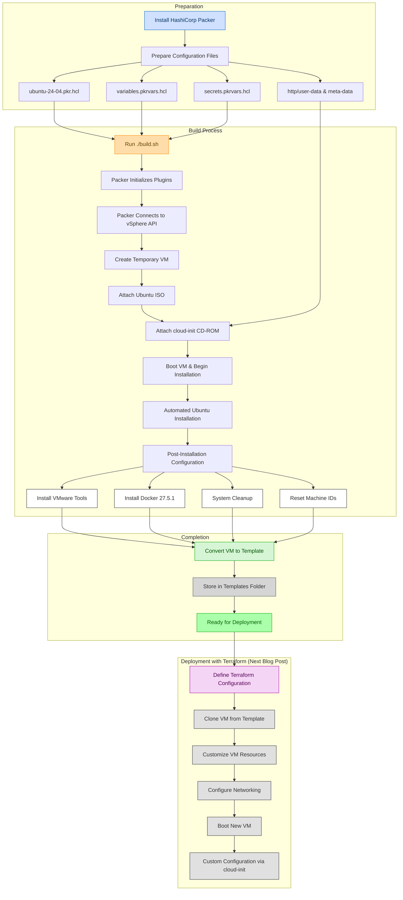

# Automating VMware vSphere Ubuntu 24.04 Templates with HashiCorp Packer

Manually building virtual machine templates in VMware vSphere is time-consuming, error-prone, and inconsistent. Creating VM templates should be automated, repeatable, and reliable. This is where HashiCorp Packer comes in - a powerful tool that automates the creation of virtual machine images across multiple platforms, including VMware vSphere.

In this comprehensive guide, we'll explore how to automate the creation of Ubuntu 24.04 VM templates for VMware vSphere using Packer. We'll dive deep into the configuration files, understand the cloud-init approach, and walk through the entire build process step by step.

## Why Automate VM Template Creation?

Before diving into the technical details, let's understand why automating VM template creation is crucial:

1. **Consistency**: Every virtual machine template is built exactly the same way, eliminating human error
2. **Efficiency**: Save hours of manual work with a repeatable automated process
3. **Version Control**: Store your template configurations in source control
4. **Integration**: Fit perfectly into CI/CD pipelines
5. **Reproducibility**: Rebuild VM templates easily when updates are needed

Manual template creation involves clicking through installation wizards, configuring settings, and installing software - a process that's not only time-consuming but also prone to inconsistencies. With Packer, we define the entire process in code.

The VMware vSphere hypervisor provides the foundation for running virtual machines in enterprise environments. By automating template creation on the VMware vSphere hypervisor, you ensure that all virtual machines deployed to your infrastructure start from a consistent baseline. This is particularly important in environments with multiple VMware vSphere hypervisor hosts or clusters, where manual template creation could lead to drift between instances.

## Understanding the Packer Environment

Our Packer configuration consists of several key files:

- `ubuntu-24-04.pkr.hcl`: The main Packer template
- `variables.pkrvars.hcl`: Non-sensitive configuration variables
- `secrets.pkrvars.hcl`: Sensitive information like vCenter credentials
- `http/user-data`: Cloud-init configuration for automated installation
- `http/meta-data`: Cloud-init metadata
- `build.sh`: Shell script to simplify the build process

Let's examine the environment requirements before proceeding:

- **VMware vCenter Server**: 7.0.3.01800 (Build number: 22837322)
- **VMware vSphere Hypervisor (ESXi)**: v6.7
- **HashiCorp Packer**: v1.12.0
- **Ubuntu**: 24.04 LTS (using ubuntu-24.04.2-live-server-amd64.iso)

The VMware vCenter Server provides centralized management of your virtual machine infrastructure. Through the vSphere API, HashiCorp Packer can communicate with the VMware vCenter Server to automate the creation of virtual machine images without manual intervention.

## Workflow Overview

Before diving into the configuration details, let's visualize the entire workflow from preparation to deployment. The following diagram illustrates the process of creating and using VM templates with Packer and Terraform:



This diagram shows the complete lifecycle:
1. **Preparation**: Setting up Packer and creating necessary configuration files
2. **Build Process**: The actual creation of the VM and installation of the operating system
3. **Completion**: Converting the configured VM into a template
4. **Deployment**: Using the template to deploy new VMs with Terraform (covered in a separate article)

Each step builds upon the previous one, creating a fully automated pipeline from configuration to deployment. Now, let's explore each component in detail.

## Setting Up the Packer Configuration

The Packer configuration in `ubuntu-24-04.pkr.hcl` defines the entire template creation process. Let's break down the key components:

### Plugin Configuration

```hcl
packer {
  required_plugins {
    vsphere = {
      version = ">= v1.2.0"
      source  = "github.com/hashicorp/vsphere"
    }
  }
}
```

This block specifies the required vSphere plugin that integrates with the VMware vSphere API to create virtual machine images. The Packer plugin exposes the full capabilities of the vSphere API, allowing for sophisticated automation of the template creation process.

### Authentication Variables

The configuration includes variables for vCenter authentication:

```hcl
variable "vcenter_username" {
  type        = string
  description = "The username for authenticating to vCenter."
  default     = ""
  sensitive   = true
}

variable "vcenter_password" {
  type        = string
  description = "The plaintext password for authenticating to vCenter."
  default     = ""
  sensitive   = true
}
```

These sensitive variables are stored in a separate `secrets.pkrvars.hcl` file to prevent accidental exposure. The vCenter Server authentication is crucial for establishing a secure connection to the VMware vCenter Server infrastructure.

For increased security in CI/CD pipelines, you can also use environment variables instead of hardcoded values in files. Packer automatically recognizes environment variables with specific naming patterns, allowing you to securely pass sensitive information without storing it in files:

```bash
export PKR_VAR_vcenter_username="your-username"
export PKR_VAR_vcenter_password="your-password" 
```

Using environment variables is particularly useful in automated build systems where secrets management is critical.

### VM Configuration

The VM specifications are defined as variables:

```hcl
variable "vm_name" {
  type        = string
  description = "The template vm name"
  default     = "Ubuntu-2404-Template"
}

variable "vm_cpu_sockets" {
  type        = number
  description = "The number of virtual CPUs sockets."
  default     = 1
}

variable "vm_cpu_cores" {
  type        = number
  description = "The number of virtual CPUs cores per socket."
  default     = 2
}

variable "vm_mem_size" {
  type        = number
  description = "The size for the virtual memory in MB."
  default     = 2048
}

variable "vm_disk_size" {
  type        = number
  description = "The size for the virtual disk in MB."
  default     = 20480
}
```

These settings make it easy to customize the virtual machine's hardware specifications. Each virtual machine deployed from the VM template will inherit these baseline specifications, though they can be adjusted during deployment.

### ISO Configuration

The configuration also includes details about the ISO file used for installation:

```hcl
variable "iso_url" {
  type        = string
  description = "The url to retrieve the iso image"
  default     = "https://releases.ubuntu.com/24.04/ubuntu-24.04.2-live-server-amd64.iso"
}

variable "iso_checksum" {
  type        = string
  description = "The checksum of the ISO image."
  default     = "d6dab0c3a657988501b4bd76f1297c053df710e06e0c3aece60dead24f270b4d"
}
```

The ISO file is the installation media for the operating system. Using a URL ensures that Packer always uses the correct ISO file version. The checksum verification ensures the integrity of the ISO file, preventing installation issues due to corrupted downloads.

## Cloud-Init Configuration Approach

One of the key innovations in this template is the CD-ROM-based cloud-init approach. Instead of using the traditional HTTP method, we package the configuration files into a virtual CD-ROM that's attached to the virtual machine during boot.

The `http/user-data` file contains the autoinstall configuration:

```yaml
#cloud-config
autoinstall:
    version: 1
    locale: en_US
    keyboard:
        layout: us
    packages:
        - open-vm-tools
        - openssh-server
        - net-tools
        # Additional packages...
    network:
        network:
            version: 2
            ethernets:
                ens192:
                    dhcp4: true
    identity:
        hostname: ubuntu-server
        username: ubuntu
        password: "$6$rounds=4096$ntlX/dlo6b$HXaLN4RcLIGaEDdQdR2VTYi9pslSeXWL131MqaakqE285Nv0kW9KRontQYivCbycZerUMcjVsuLl2V8bbdadI1"
    ssh:
        install-server: yes
        allow-pw: yes
        authorized-keys:
            - ssh-rsa AAAAB3NzaC1...
    storage:
        layout:
            name: direct
    user-data:
        disable_root: false
    late-commands:
        - echo 'ubuntu ALL=(ALL) NOPASSWD:ALL' > /target/etc/sudoers.d/ubuntu
        - curtin in-target --target=/target -- chmod 440 /etc/sudoers.d/ubuntu
```

This configuration handles the automated installation of Ubuntu with our desired settings. The CD-ROM approach is more reliable than HTTP, especially in networking-restricted environments.

## The Build Process

The build block in the Packer configuration defines what happens after the virtual machine is created:

```hcl
build {
  sources = ["source.vsphere-iso.ubuntu-2404"]

  # Post-installation VM tools configuration
  provisioner "shell" {
    inline = [
      # Wait for cloud-init to complete
      "while [ ! -f /var/lib/cloud/instance/boot-finished ]; do echo 'Waiting for cloud-init...'; sleep 1; done",
      # Configure VMware tools and clean up
      # ...
    ]
  }

  # Docker installation
  provisioner "shell" {
    inline = [
      "echo 'Installing Docker...'",
      # Docker installation commands
      # ...
    ]
  }

  # System cleanup
  provisioner "shell" {
    inline = [
      "echo 'Cleaning up...'",
      # Cleanup commands
      # ...
    ]
  }

  # Template preparation
  provisioner "shell" {
    inline = [
      "echo 'Preparing for template conversion...'",
      # Template preparation commands
      # ...
    ]
  }
}
```

This is where the real power of HashiCorp Packer shines. After installing the OS, Packer:

1. Waits for cloud-init to complete
2. Configures VMware tools
3. Installs Docker 27.5.1 with a pinned version
4. Cleans up the system to reduce template size
5. Prepares the virtual machine for conversion to a VM template

While our example focuses on Ubuntu, the Packer plugin VMware supports a wide range of guest operating systems, including Microsoft Windows Server. The same approach can be used to create templates for any supported OS, with appropriate modifications to the installation process.

## vSphere Endpoint Configuration

The source configuration in the Packer template includes vSphere endpoint details:

```hcl
source "vsphere-iso" "ubuntu-2404" {
  vcenter_server      = var.vcenter_server
  username            = var.vcenter_username
  password            = var.vcenter_password
  datacenter          = var.vcenter_datacenter
  datastore           = var.vcenter_datastore
  host                = var.vcenter_host
  cluster             = var.vcenter_cluster
  folder              = var.vcenter_folder
  insecure_connection = var.vcenter_insecure_connection
  
  # Additional configuration...
}
```

These settings define the vSphere endpoint where the template will be created. In environments with multiple vCenter Server instances, you can specify which instance to use. The vSphere API uses these connection details to establish communication with your VMware infrastructure.

## Running the Build Process

To execute the build process, we use the provided `build.sh` script:

```bash
#!/bin/bash
# Navigate to the directory containing this script
cd "$(dirname "$0")"

# Check if Packer is installed
if ! command -v packer &> /dev/null; then
    echo "Packer is not installed. Please install it from https://www.packer.io/downloads"
    exit 1
fi

# Check if secrets file exists
if [ ! -f "secrets.pkrvars.hcl" ]; then
    echo "Creating example secrets file..."
    cp example.pkrvars.hcl secrets.pkrvars.hcl
    echo "Please edit secrets.pkrvars.hcl with your actual vSphere credentials before running this script again."
    exit 1
fi

# Initialize Packer plugins
echo "Initializing Packer plugins..."
packer init ubuntu-24-04.pkr.hcl

# Run Packer build with variable files
echo "Starting Packer build..."
PACKER_LOG=1 packer build -force -on-error=ask \
  -var-file=secrets.pkrvars.hcl \
  -var-file=variables.pkrvars.hcl \
  ubuntu-24-04.pkr.hcl

echo "Build process completed!"
```

This script checks for dependencies, validates configurations, and runs the Packer build command with detailed logging. Note that you can modify this script to use environment variables instead of the secrets file by adding export statements before running Packer, which is useful in CI/CD environments.

## Using Environment Variables for Automation

For automated builds, especially in CI/CD pipelines, using environment variables provides better security than configuration files. You can configure your build process to use environment variables by:

1. Setting up the environment variables in your CI/CD system (GitHub Actions, Jenkins, etc.)
2. Modifying the build script to use these environment variables
3. Passing the variables to Packer using the `-var` flag or letting Packer automatically pick up `PKR_VAR_` prefixed variables

This approach keeps sensitive information out of your source code repository while still allowing for automated builds.

## Demo of the Process

Let's walk through the process as demonstrated in the video:

1. **Initial Setup**: Ensure your VMware vCenter Server is accessible and your Packer configuration files are properly set up with your vSphere environment details.

2. **Running the Build Script**: Execute `./build.sh` to start the build process. The script initializes Packer plugins and starts the build with detailed logging.

3. **VM Creation and Boot**: HashiCorp Packer creates a virtual machine in vSphere using the specified Ubuntu ISO file. You can observe this process in the vCenter UI.

4. **Automated Installation**: The virtual machine boots from the ISO file and uses the cloud-init configuration for an automated installation. No manual intervention is required.

5. **Post-Installation Configuration**: After installation, Packer runs the shell provisioners to configure the system, install Docker, and prepare for template conversion.

6. **Template Conversion**: Finally, Packer converts the virtual machine to a VM template, which can be seen in the vSphere Templates folder.

The entire process takes about 20-26 minutes to complete, depending on your infrastructure performance.

## Benefits of the Automated VM Templates

The resulting VM template has several advantages:

1. **Pre-installed Software**: Docker 27.5.1 with docker-compose is already installed, saving time when deploying new virtual machines.

2. **Cloud-init Ready**: The VM template is configured for cloud-init, enabling further customization when deploying virtual machines.

3. **Optimized for Cloning**: The VM template is properly cleaned up, with unique identifiers reset to ensure proper functioning when cloned.

4. **VMware Tools Configured**: VMware tools are pre-installed and configured for optimal performance with the VMware vSphere hypervisor.

5. **Repeatable Process**: If you need to update the VM template, simply run the build script again, and it will create a new version with the latest updates.

## Using the Template with Terraform

While this blog post focuses on creating the VM template with Packer, the next logical step is to use Terraform to deploy virtual machines from this template. Terraform can automate the process of cloning the template, customizing the virtual machine (changing CPU, memory, disk size), and configuring the network settings.

The combination of HashiCorp Packer for VM template creation and Terraform for virtual machine deployment provides a complete end-to-end automation solution for your VMware vSphere environment. When using Terraform with these VM templates, you can also leverage environment variables to provide credentials and configuration values securely.

## Cross-Platform Compatibility

Although we've focused on vSphere in this article, it's worth noting that the Packer plugin VMware supports other virtualization platforms as well, including VMware Workstation. This allows developers to test VM templates locally on their workstations before deploying to production environments, ensuring a smooth workflow from development to production.

## Permissions Management

When setting up Packer to work with vSphere, you'll need to configure appropriate permissions. This typically involves using the add permissions dialog box in vCenter to assign the necessary privileges to the service account Packer will use. At minimum, the account needs permissions to create and modify virtual machines, access datastores, and interact with networks.

## Troubleshooting Tips

If you encounter issues during the build process, here are some troubleshooting tips:

1. **Check Packer Version**: Ensure you're using HashiCorp Packer v1.12.0 or later.

2. **Verify vSphere Credentials**: Double-check your vCenter Server credentials and permissions.

3. **ISO Checksum Issues**: If the ISO file checksum doesn't match, update it in the configuration:
   ```bash
   curl -s https://releases.ubuntu.com/24.04/SHA256SUMS | grep live-server-amd64.iso
   ```

4. **Network Connectivity**: Ensure the virtual machine can obtain an IP address via DHCP.

5. **Virtual Hardware Version**: Verify that your VMware vSphere hypervisor supports the virtual machine hardware version specified in the configuration.

6. **Environment Variables**: If using environment variables, ensure they are correctly set and accessible to the Packer process. You can debug by adding echo statements to your build script to verify the values:
   ```bash
   echo "Using username: $PKR_VAR_vcenter_username"
   ```

## Conclusion

Automating the creation of Ubuntu 24.04 VM templates in VMware vSphere with HashiCorp Packer significantly improves efficiency, consistency, and reliability. By leveraging the vSphere API and cloud-init for automated installations, we can create virtual machine images that are ready for deployment with minimal effort.

The CD-ROM-based cloud-init approach provides a robust solution that works even in restrictive network environments. The resulting VM template, with pre-installed software like Docker, saves valuable time during virtual machine deployments.

By combining Packer for VM template creation with Terraform for virtual machine deployment, you can build a complete infrastructure-as-code solution for your VMware vSphere environment. This approach fits perfectly into modern CI/CD pipelines, enabling you to treat your infrastructure just like any other code.

No more manual clicks, no more inconsistencies, no more wasted time - just efficient, automated, and repeatable VM template creation with Packer.
